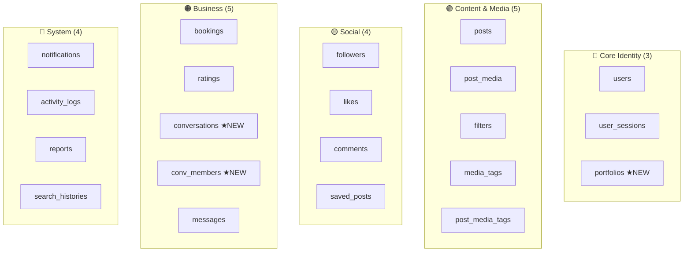
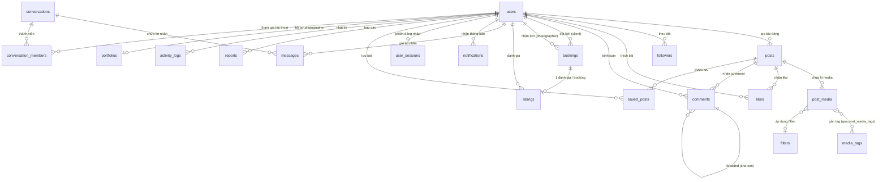
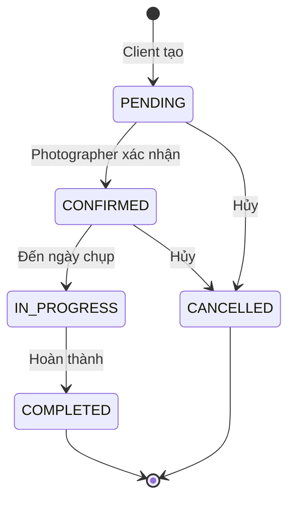
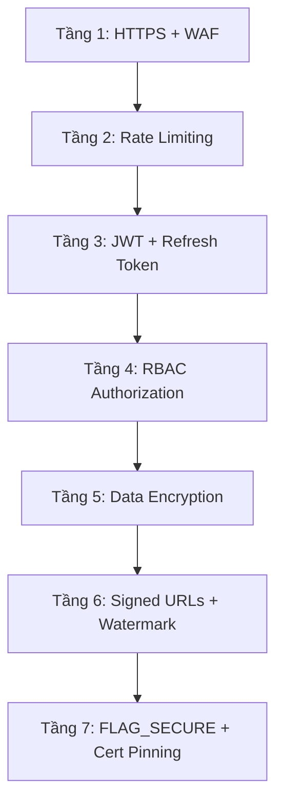

# 📸 InstaGallery — Tài Liệu Tổng Hợp Xây Dựng Hệ Thống

> **MỤC ĐÍCH:** Tài liệu duy nhất bạn cần để xây dựng InstaGallery từ đầu đến production.
> **Tổng hợp từ:** 8 tài liệu nguồn | **Cập nhật:** 10/03/2026

---

## Mục Lục

| Phần | Nội dung | Trang |
|---|---|---|
| **I** | [Tổng Quan Dự Án](#i-tổng-quan-dự-án) | Dự án là gì, cho ai |
| **II** | [Kiến Trúc Hệ Thống](#ii-kiến-trúc-hệ-thống) | Android + Backend + Infra |
| **III** | [Cấu Trúc Project](#iii-cấu-trúc-project) | Folder structure cả 2 project |
| **IV** | [Database Schema (21 bảng)](#iv-database-schema) | SQL copy-paste chạy luôn |
| **V** | [API Endpoints (94 endpoints)](#v-api-endpoints) | Mapping endpoint ↔ DB |
| **VI** | [Bảo Mật 7 Tầng](#vi-bảo-mật-7-tầng) | Từ HTTPS đến FLAG_SECURE |
| **VII** | [Lộ Trình 12 Tuần](#vii-lộ-trình-12-tuần) | Tuần-đến-tuần, ngày-đến-ngày |
| **VIII** | [DevOps & Deployment](#viii-devops--deployment) | Docker, CI/CD, Monitor |
| **IX** | [Code Mẫu Ktor](#ix-code-mẫu-ktor) | Từng layer |
| **X** | [Checklist Tổng](#x-checklist-tổng) | Đảm bảo không thiếu gì |

---

## I. Tổng Quan Dự Án

### 1.1. InstaGallery là gì?

| Khía cạnh | Chi tiết |
|---|---|
| **Tên** | InstaGallery — Hệ thống Giao lưu Ảnh Android |
| **Mục tiêu** | Kết nối nhiếp ảnh gia & khách hàng, chia sẻ ảnh chuyên nghiệp |
| **USP** | Booking photographer + Portfolio + Bảo vệ bản quyền ảnh |
| **Nền tảng** | Android (Jetpack Compose) + Backend (Ktor) + Admin Web |

### 1.2. Ai sử dụng?

| Role | Làm gì |
|---|---|
| **PHOTOGRAPHER** | Upload ảnh, tạo portfolio, nhận booking, chat khách |
| **Khách hàng** | Tìm kiếm và thuê thợ chụp ảnh, tương tác với nội dung |
| **ADMIN** | Quản lý user, kiểm duyệt nội dung, xem thống kê |

### 1.3. Yêu cầu chức năng (MVP 3 tháng)
Đây là cách phân chia "làm cái nào trước, cái nào sau".
| Ưu tiên | Chức năng |
|---|---|
| 🔴 P0 | Auth (Login, Register, JWT + Refresh), User Profile |
| 🔴 P0 | Upload ảnh multi-media, Feed, Explore |
| 🔴 P0 | Like, Comment (threaded), Save Post |
| 🟡 P1 | Follow/Unfollow, Search (users, tags, posts) |
| 🟡 P1 | Booking photographer, Rating & Review |
| 🟢 P2 | Chat/Messaging (WebSocket), Notifications |
| 🟢 P2 | Portfolio management, Admin Dashboard (Web) |

---

## II. Kiến Trúc Hệ Thống

### 2.1. Kiến trúc tổng thể

```mermaid
graph TB
    subgraph "📱 Client Layer"
        Android["Android App<br/>Kotlin + Jetpack Compose<br/>MVVM + Clean Architecture"]
        AdminWeb["Admin Dashboard<br/>Next.js (Phase 3)"]
    end

    "" Giải thích: 
    📱Client Layer = Khách hàng đến ăn
            Android App    = Khách ngồi trong nhà hàng (app chính, dùng hàng ngày)
            Admin Web      = Ông chủ nhà hàng (quản lý từ máy tính, không ai thấy)
            Giải thích: Cả 2 đều "gọi món" (gửi request) tới bếp (backend).
    ""

    subgraph "🌐 Backend (Ktor) (là nhà bếp)"
    //Bên trong bếp có nhiều bếp trưởng, mỗi người lo 1 việc.//
        APIGW["Ktor Server<br/>Netty Engine"] //Cổng chính: Tất cả request phải đi qua đây
        Auth["Auth Module<br/>JWT + bcrypt"] //Bảo vệ của: "Anh có thẻ VIP không? Cho xem JWT token"
        Post["Post Module"] //Bếp chính: Xử lý upload ảnh, hiện feed, explore
        Book["Booking Module"] //Bộ phận đặt bàn: Khách đặt lịch chụp với photographer
        Chat["Chat Module<br/>WebSocket"] //Điện thoại nội bộ: Nhắn tin qua lại real-time
        Notif["Notification Module"] //Loa thông báo: "Bàn 5 ơi, có người like ảnh bạn!"
        Search["Search Module"] //Cuốn menu: Tìm kiếm user, ảnh, hashtag
    end

    subgraph "💾 Data Layer" // Kho chứa
        MySQL[(MySQL 8.x<br/>21 bảng)] //Ngăn kéo đựng đồ ăn. Tất cả dữ liệu: user, post, comment, booking (21 bảng)
        Redis[(Redis 7.x<br/>Cache + Session)] //Khay đá giữ đồ tươi. Lưu tạm: ai đang online, ai vừa like ảnh (để tính real-time)
        S3[Firebase Storage<br/>Ảnh + Video] //Tủ lạnh lớn đựng ảnh. Chứa file nặng: ảnh, video (để không làm nặng database)
    end

    Android --> APIGW //📱 User mở app → app gọi API tới Ktor Server.
    AdminWeb --> APIGW //💻 Admin mở trang web quản trị → cũng gọi API tới cùng Ktor Server.
    APIGW --> Auth & Post & Book & Chat & Notif & Search  
    Auth & Post & Book --> MySQL
    Auth --> Redis
    Post --> S3
    Chat --> Redis
    //Ktor Server nhận request → chuyển tới đúng module xử lý.
      <!-- Ví dụ:
      Gọi /api/auth/login → chuyển tới Auth Module
      Gọi /api/posts → chuyển tới Post Module
      Gọi /api/bookings → chuyển tới Booking Module -->
    
```

### 2.2. Kiến trúc Android (MVVM + Clean Architecture)

```
┌─────────────────────────────────────────────────┐
│              PRESENTATION LAYER                  │
│  Jetpack Compose │ ViewModels │ StateFlow        │
├─────────────────────────────────────────────────┤
│                 DOMAIN LAYER                     │
│  Use Cases │ Entities │ Repository Interfaces    │
├─────────────────────────────────────────────────┤
│                  DATA LAYER                      │
│  Repository Impl │ Retrofit (API) │ Room (Local) │
└─────────────────────────────────────────────────┘
```Ví dụ để dễ hiểu: 
┌──────────────────────────────────────────────────────┐
│  PRESENTATION = Giao diện (mắt thấy, tay chạm)      │
│                                                       │
│  📱 Jetpack Compose  = Màn hình app (nút bấm, ảnh)   │
│  🧠 ViewModel        = Bộ não xử lý logic UI         │
│  📊 StateFlow        = Trạng thái màn hình            │
│                        (loading/success/error)         │
├──────────────────────────────────────────────────────┤
│  DOMAIN = Luật chơi (logic nghiệp vụ)                │
│                                                       │
│  ⚙️ Use Cases  = "Đặt booking phải check lịch trống" │
│  📦 Entities   = User, Post, Booking (data thuần)     │
│  📋 Repository Interfaces = Hợp đồng: "tôi CẦN data, │
│                             không quan tâm lấy ở đâu" │
├──────────────────────────────────────────────────────┤
│  DATA = Lấy data từ đâu (internet? local?)           │
│                                                       │
│  🌐 Retrofit   = Gọi API backend (Ktor server)       │
│  💾 Room        = Database local trên điện thoại      │
│  🔄 Repository Impl = "Có mạng → gọi API,            │
│                        Mất mạng → lấy từ Room"        │
└──────────────────────────────────────────────────────┘


### 2.3. Tech Stack Decision

#### Backend: Ktor (Quyết định)

| Tiêu chí | Ktor ✅ | Spring Boot |
|---|---|---|
| Ngôn ngữ | Kotlin-native | Kotlin/Java |
| Lightweight | ✅ Rất nhẹ | ❌ Nặng |
| Learning curve | ✅ Đơn giản | ❌ Phức tạp cho newbie |
| Coroutines | ✅ Native | ⚠️ Cần cấu hình |
| Ecosystem | ⚠️ Nhỏ hơn | ✅ Rất lớn |
| **Phù hợp MVP** | **✅ Tốt nhất** | Quá phức tạp |

#### Android Tech Stack

| Thành phần | Công nghệ |
|---|---|
| Language | Kotlin 2.x |
| UI | Jetpack Compose + Material 3 |
| Architecture | MVVM + Clean Architecture |
| DI | Hilt (Dagger) |
| Networking | Retrofit + OkHttp |
| Image Loading | Coil |
| Local DB | Room + SQLCipher |
| State | StateFlow + MutableStateFlow |
| Navigation | Compose Navigation |
| Testing | JUnit5 + Mockk |

#### Backend Tech Stack (Ktor)

| Thành phần | Công nghệ |
|---|---|
| Framework | Ktor 3.x + Netty |
| Serialization | kotlinx-serialization-json |
| ORM | Exposed (JetBrains) |
| Connection Pool | HikariCP |
| Auth | ktor-server-auth-jwt + jBCrypt |
| DI | Koin |
| WebSocket | ktor-server-websockets |
| Rate Limiting | ktor-server-rate-limit |
| Error Handling | StatusPages plugin |
| Logging | ktor-server-call-logging  |
| Push Notification | Firebase Admin SDK |
---

## III. Cấu Trúc Project

### 3.1. Android Project

```
instagallery-android/
├── app/src/main/kotlin/com/instagallery/
│   ├── ui/                         ← Jetpack Compose screens
│   │   ├── auth/                   ← Login, Register
│   │   ├── feed/                   ← Home feed
│   │   ├── profile/                ← User profile
│   │   ├── search/                 ← Search
│   │   ├── upload/                 ← Upload photo
│   │   ├── booking/                ← Booking flow
│   │   ├── chat/                   ← Messaging
│   │   └── components/             ← Reusable composables
│   ├── viewmodel/                  ← ViewModels
│   ├── domain/
│   │   ├── model/                  ← Domain entities
│   │   ├── usecase/                ← Business logic
│   │   └── repository/            ← Repository interfaces
│   ├── data/
│   │   ├── remote/                 ← Retrofit API services
│   │   │   ├── api/               ← API interfaces
│   │   │   ├── dto/               ← Request/Response DTOs
│   │   │   └── interceptor/       ← Auth interceptor (JWT)
│   │   ├── local/                  ← Room database
│   │   └── repository/            ← Repository implementations
│   └── di/                         ← Hilt modules
├── build.gradle.kts
└── settings.gradle.kts
```

### 3.2. Backend Project (Ktor)

```
instagallery-backend/
├── src/main/kotlin/com/instagallery/
│   ├── Application.kt              ← Entry point
│   ├── plugins/                     ← Ktor plugin configs
│   │   ├── Routing.kt
│   │   ├── Security.kt             ← JWT
│   │   ├── Serialization.kt
│   │   ├── Database.kt             ← MySQL + Exposed
│   │   ├── CORS.kt
│   │   ├── RateLimiting.kt
│   │   └── StatusPages.kt          ← Error handling
│   ├── models/                      ← Data classes
│   │   ├── request/                ← RegisterRequest, LoginRequest...
│   │   ├── response/               ← UserDTO, PostDTO...
│   │   └── common/                 ← ApiResponse, Pagination
│   ├── database/tables/            ← Exposed Table definitions
│   │   ├── UsersTable.kt
│   │   ├── PostsTable.kt
│   │   ├── LikesTable.kt
│   │   └── ... (21 tables)
│   ├── repositories/               ← Data access
│   ├── services/                    ← Business logic
│   ├── routes/                      ← API route handlers
│   │   ├── AuthRoutes.kt
│   │   ├── UserRoutes.kt
│   │   ├── PostRoutes.kt
│   │   ├── BookingRoutes.kt
│   │   ├── ConversationRoutes.kt
│   │   ├── SearchRoutes.kt
│   │   └── AdminRoutes.kt
│   └── utils/
│       ├── JwtManager.kt
│       └── PasswordHasher.kt
├── src/main/resources/
│   └── application.conf
├── build.gradle.kts
├── Dockerfile
└── docker-compose.yml
```

---

## IV. Database Schema (21 Bảng)

### 4.1. Tổng quan bảng



---

### 4.2. ERD Tổng Thể


### 4.3. SQL Schema — Copy-paste hoàn chỉnh

> [!IMPORTANT]
> SQL đầy đủ 21 bảng + triggers có trong file chi tiết:
> - [instagallery_complete_system.md](file:///C:/Users/Ngoc%20Pham/.gemini/antigravity/brain/ba268932-d009-4f19-a9fd-1f979e2cae72/instagallery_complete_system.md) → Phần C (đầy đủ SQL)
> - [instagallery_db_analysis.md](file:///C:/Users/Ngoc%20Pham/.gemini/antigravity/brain/ba268932-d009-4f19-a9fd-1f979e2cae72/instagallery_db_analysis.md) → Phân tích chi tiết

### 4.4. Thứ tự tạo bảng (vì Foreign Key dependencies)

```
Đợt 1 (Không dependency):     users, filters, media_tags, conversations
Đợt 2 (Phụ thuộc users):      user_sessions, portfolios, followers,
                                search_histories, activity_logs
Đợt 3 (Phụ thuộc users+):     posts, bookings, notifications, reports,
                                conversation_members
Đợt 4 (Phụ thuộc posts):      post_media, likes, comments, saved_posts
Đợt 5 (Phụ thuộc media+):     post_media_tags, ratings, messages
Đợt 6:                         Triggers (like_count, follow_count)
```

### 4.5. Denormalization Counters + Triggers

| Bảng | Counter | Đồng bộ bởi |
|---|---|---|
| `posts` | `like_count`, `comment_count` | DB Trigger |
| `users` | `follower_count`, `following_count`, `post_count` | DB Trigger |
| `comments` | `like_count`, `reply_count` | App logic |
| `portfolios` | `rating_avg`, `review_count` | App logic |

---

## V. API Endpoints (94 Endpoints)

> [!TIP]
> Chi tiết logic, validation, và response mẫu cho mỗi endpoint có trong:
> - [instagallery_api_analysis.md](file:///C:/Users/Ngoc%20Pham/.gemini/antigravity/brain/ba268932-d009-4f19-a9fd-1f979e2cae72/instagallery_api_analysis.md)
> - [instagallery_complete_system.md](file:///C:/Users/Ngoc%20Pham/.gemini/antigravity/brain/ba268932-d009-4f19-a9fd-1f979e2cae72/instagallery_complete_system.md) → Phần E

### Tổng hợp theo Module

| Module | Endpoints | Bảng DB chính | Implement tuần |
|---|---|---|---|
| I. Auth & User | 20 | `users`, `user_sessions` | **Tuần 3-4** |
| II. Posts & Media | 11 | `posts`, `post_media` | **Tuần 5** |
| III. Interactions | 13 | `likes`, `comments`, `saved_posts` | **Tuần 5-6** |
| IV. Follow & Feed | 4 | `followers` | **Tuần 6** |
| V. Search | 8 | `media_tags`, `search_histories` | **Tuần 6-7** |
| VI. Booking & Rating | 9 | `bookings`, `ratings`, `portfolios` | **Tuần 7-8** |
| VII. Messaging | 9 | `conversations`, `messages` | **Tuần 8-9** |
| VIII. Notifications | 4 | `notifications` | **Tuần 9** |
| IX. Admin | 15 | tất cả bảng | **Tuần 10** |
| X. Portfolio | 3 | `portfolios` | **Tuần 10** |
| System | 2 | — | **Tuần 3** |

### Response Format chuẩn

```json
// ✅ Success
{ "status": "success", "data": {...}, "pagination": {...} }

// ❌ Error
{ "status": "error", "error": { "code": "AUTH_WRONG_PASSWORD", "message": "..." } }
```

### Booking State Machine



| Transition | Client | Photographer | Admin |
|---|---|---|---|
| PENDING → CONFIRMED | ❌ | ✅ | ✅ |
| PENDING → CANCELLED | ✅ | ✅ | ✅ |
| CONFIRMED → IN_PROGRESS | ❌ | ✅ | ✅ |
| IN_PROGRESS → COMPLETED | ❌ | ✅ | ✅ |
| COMPLETED/CANCELLED → * | ❌ | ❌ | ❌ |

---

## VI. Bảo Mật 7 Tầng



### Ưu tiên cho Newbie

```
🟢 Bắt buộc (Tuần 3-4):
  ├── HTTPS (deploy lên HTTPS)
  ├── JWT + Refresh Token
  ├── bcrypt password hashing
  ├── Input validation mọi endpoint
  └── CORS configuration

🟡 Nên có (Tuần 8-10):
  ├── Rate Limiting (Redis)
  ├── Signed URLs cho images
  ├── Role-based authorization
  └── EncryptedSharedPreferences

🔴 Nâng cao (Tuần 11-12):
  ├── Certificate Pinning
  ├── Server-side watermark
  ├── Audit logging
  └── ProGuard/R8 (release build)
```

### Rate Limiting

| Endpoint | Limit | Window |
|---|---|---|
| `/auth/login` | 5 req | 15 min |
| `/auth/register` | 3 req | 1 hour |
| `POST /posts` | 30 req | 1 hour |
| `POST /*/like` | 60 req | 1 min |
| `GET /search` | 30 req | 1 min |

---

## VIII. DevOps & Deployment

### Docker Compose

```yaml
services:
  mysql:
    image: mysql:8.0
    environment:
      MYSQL_ROOT_PASSWORD: root_password
      MYSQL_DATABASE: instagallery
    ports: ["3306:3306"]
    volumes:
      - mysql_data:/var/lib/mysql
      - ./sql/schema.sql:/docker-entrypoint-initdb.d/init.sql

  redis:
    image: redis:7-alpine
    ports: ["6379:6379"]

  app:
    build: .
    ports: ["8080:8080"]
    depends_on: [mysql, redis]
    environment:
      DB_URL: jdbc:mysql://mysql:3306/instagallery
      DB_USER: root
      DB_PASSWORD: root_password
      JWT_SECRET: your-256-bit-secret
      REDIS_HOST: redis

volumes:
  mysql_data:
```

### CI/CD (GitHub Actions)

```yaml
name: InstaGallery CI
on:
  push:
    branches: [main, develop]
jobs:
  test:
    runs-on: ubuntu-latest
    steps:
      - uses: actions/checkout@v4
      - uses: actions/setup-java@v4
        with: { java-version: '17', distribution: 'temurin' }
      - run: ./gradlew test

  build:
    needs: test
    runs-on: ubuntu-latest
    steps:
      - uses: docker/build-push-action@v5
        with:
          push: true
          tags: ghcr.io/${{ github.repository }}:${{ github.sha }}
```

### Monitoring

| Metric | Alert khi | Tool |
|---|---|---|
| API Response (p95) | > 2 seconds | Prometheus + Grafana |
| Error Rate (5xx) | > 1% | Grafana Alert |
| CPU Usage | > 80% for 5min | Grafana Alert |
| Failed Login | > 10/min from same IP | Rate Limiter log |

---


## 📚 Tham Chiếu Tài Liệu Chi Tiết

| Tài liệu | Nội dung chi tiết |
|---|---|
| [instagallery_complete_system.md](file:///C:/Users/Ngoc%20Pham/.gemini/antigravity/brain/ba268932-d009-4f19-a9fd-1f979e2cae72/instagallery_complete_system.md) | SQL schema đầy đủ, ERD, API ↔ DB mapping, Cache/Partition strategy |
| [instagallery_db_analysis.md](file:///C:/Users/Ngoc%20Pham/.gemini/antigravity/brain/ba268932-d009-4f19-a9fd-1f979e2cae72/instagallery_db_analysis.md) | Phân tích normalization, index strategy, sequence diagrams |
| [instagallery_api_analysis.md](file:///C:/Users/Ngoc%20Pham/.gemini/antigravity/brain/ba268932-d009-4f19-a9fd-1f979e2cae72/instagallery_api_analysis.md) | Logic chi tiết 94 endpoints, validation rules, response mẫu |
| [instagallery_ktor_roadmap.md](file:///C:/Users/Ngoc%20Pham/.gemini/antigravity/brain/ba268932-d009-4f19-a9fd-1f979e2cae72/instagallery_ktor_roadmap.md) | Code mẫu Ktor 7 lớp, Gradle dependencies, Docker setup |
| [instagallery_architectural_review.md](file:///C:/Users/Ngoc%20Pham/OneDrive%20-%20nien.edu.vn/Documents/%C4%90%E1%BB%93%20%C3%A1n%20t%E1%BB%91t%20nghi%E1%BB%87p/instagallery_architectural_review.md) | Đánh giá kiến trúc, module hóa Android, image protection flow |
| [production_security_devops.md](file:///C:/Users/Ngoc%20Pham/OneDrive%20-%20nien.edu.vn/Documents/%C4%90%E1%BB%93%20%C3%A1n%20t%E1%BB%91t%20nghi%E1%BB%87p/B%E1%BB%99%20t%C3%A0i%20li%E1%BB%87u%20Production/production_security_devops.md) | Dockerfile, Docker Compose production, CI/CD YAML, Monitoring |
