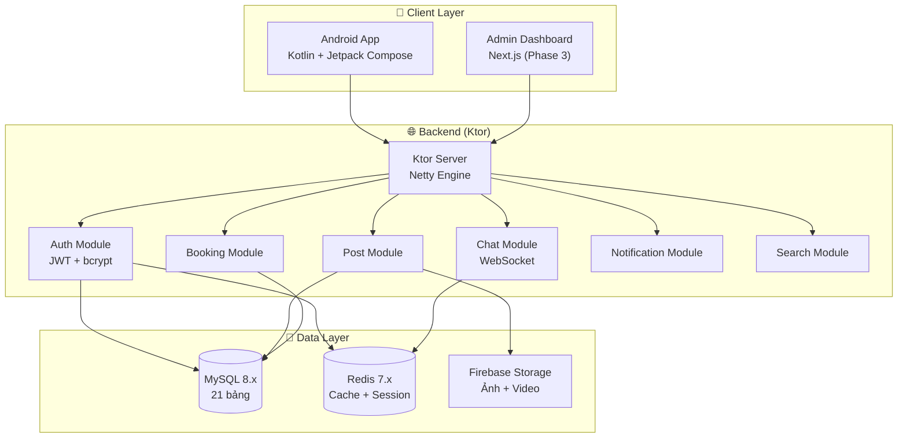
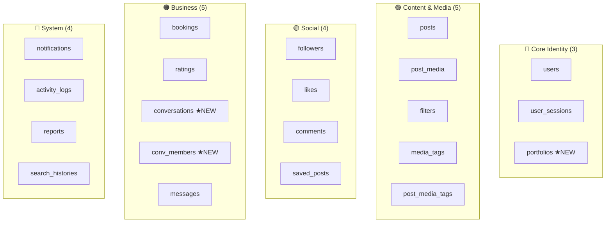
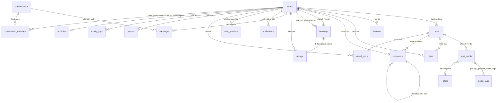
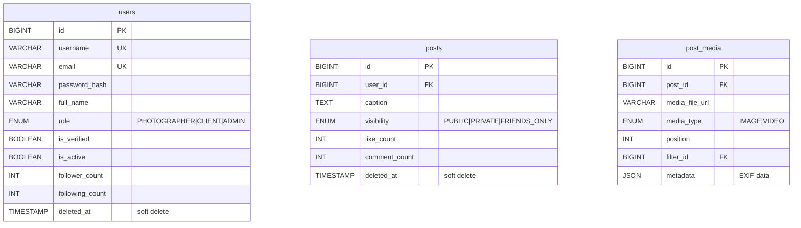
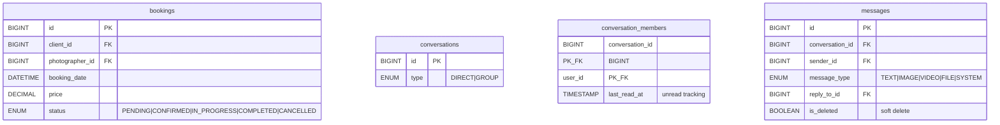
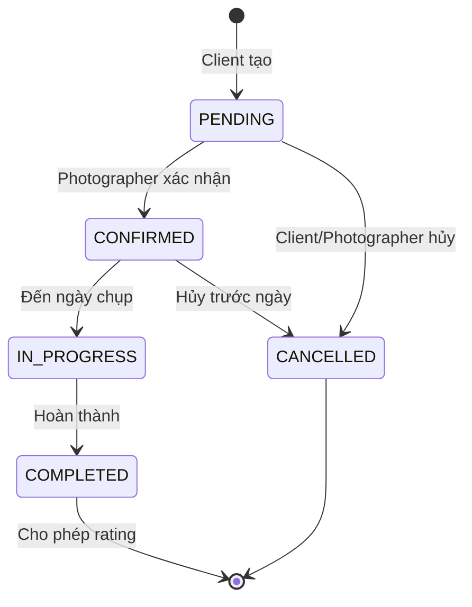
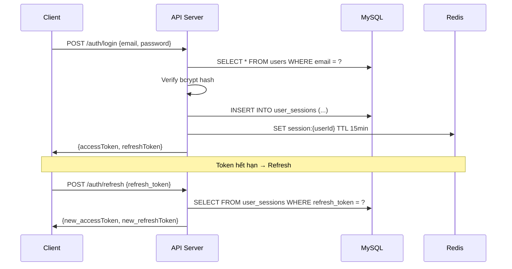
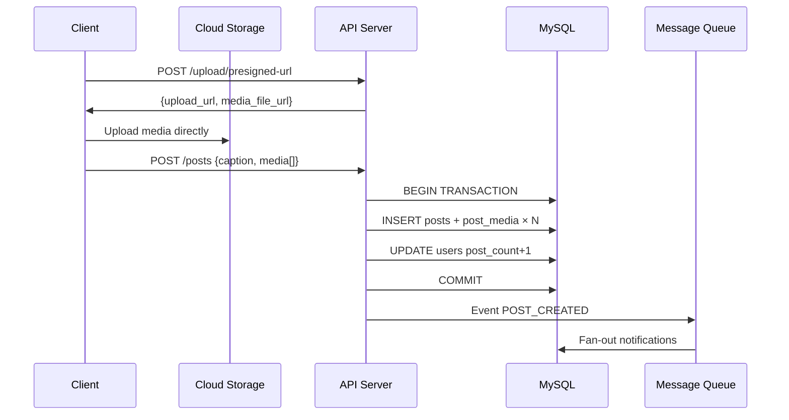
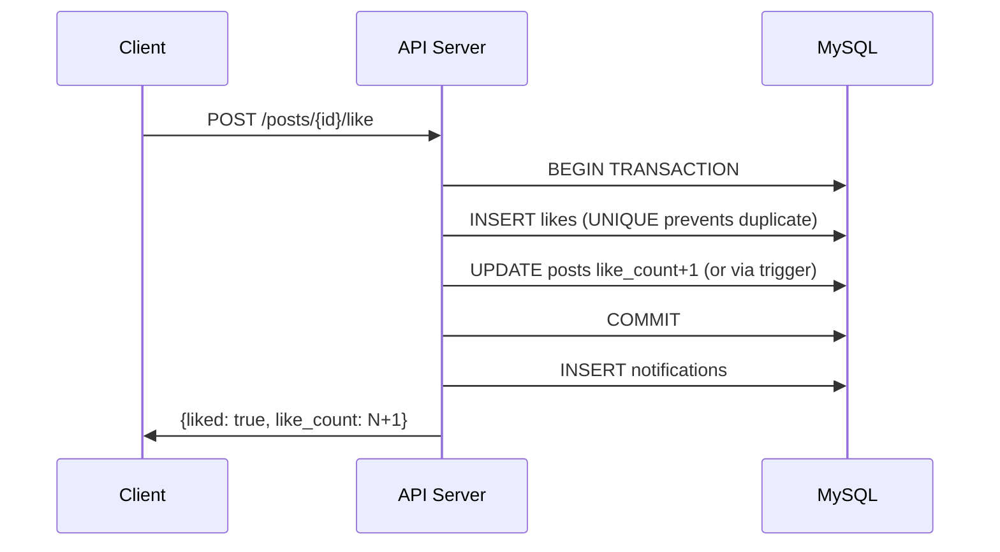
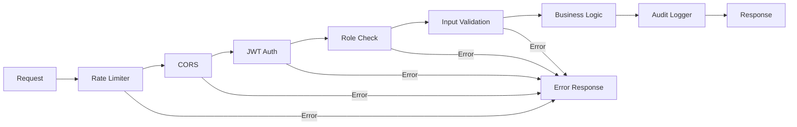

# 📸 InstaGallery — Tài Liệu Hệ Thống Toàn Diện (Database + API)

> **Phiên bản:** Production-Ready | **Đánh giá:** 10/10
> Tổng hợp từ phân tích CSDL và API, bao gồm tất cả fix & enhancement.

---

## Mục Lục

| Phần | Nội dung |
|---|---|
| **A** | [Kiến Trúc Tổng Quan](#a-kiến-trúc-tổng-quan) |
| **B** | [ERD & Quan Hệ Giữa Các Bảng](#b-erd--quan-hệ-giữa-các-bảng) |
| **C** | [SQL Schema Hoàn Chỉnh (21 bảng)](#c-sql-schema-hoàn-chỉnh) |
| **D** | [Phân Tích Chuẩn Hóa & Denormalization](#d-phân-tích-chuẩn-hóa) |
| **E** | [API Endpoints Toàn Bộ (94 endpoints)](#e-api-endpoints-toàn-bộ) |
| **F** | [Chi Tiết Logic Từng Module API](#f-chi-tiết-logic-từng-module) |
| **G** | [Luồng Dữ Liệu (Sequence Diagrams)](#g-luồng-dữ-liệu) |
| **H** | [Bảo Mật & Middleware](#h-bảo-mật--middleware) |
| **I** | [Hiệu Suất & Scale](#i-hiệu-suất--scale) |
| **J** | [Checklist Production-Ready](#j-checklist) |

---

## A. Kiến Trúc Tổng Quan

### Thống kê hệ thống

| Chỉ số | Giá trị |
|---|---|
| Tổng số bảng | **21** (16 gốc + 3 mới + 2 junction) |
| Tổng API endpoints | **94** (40 gốc + 28 mới + 26 bổ sung) |
| API Modules | **10** (Auth, Posts, Interactions, Follow, Search, Booking, Messaging, Notifications, Admin, Portfolio + System) |
| Hệ quản trị | MySQL 8.x, utf8mb4, InnoDB |
| Lưu trữ media | URL → Firebase Storage / AWS S3 |

### Kiến trúc hệ thống



### Phân nhóm bảng



---

## B. ERD & Quan Hệ Giữa Các Bảng

### ERD Tổng Thể



### ERD Chi Tiết — Users & Posts



### ERD Chi Tiết — Business & Messaging



---

## C. SQL Schema Hoàn Chỉnh

> [!IMPORTANT]
> Tất cả ID dùng `BIGINT`. Có đầy đủ indexes, UNIQUE/CHECK constraints, soft delete, `ON UPDATE CURRENT_TIMESTAMP`. Copy-paste vào MySQL là chạy.

### C.1. Core Identity

```sql
CREATE TABLE users (
    id                  BIGINT AUTO_INCREMENT PRIMARY KEY,
    username            VARCHAR(50)  NOT NULL,
    email               VARCHAR(100) NOT NULL,
    password_hash       VARCHAR(255) NOT NULL,
    full_name           VARCHAR(100) NOT NULL,
    profile_picture_url VARCHAR(255) DEFAULT NULL,
    bio                 TEXT DEFAULT NULL,
    website             VARCHAR(255) DEFAULT NULL,
    gender              VARCHAR(10)  DEFAULT NULL,
    phone_number        VARCHAR(20)  DEFAULT NULL,
    date_of_birth       DATE DEFAULT NULL,
    location            VARCHAR(255) DEFAULT NULL,
    role                ENUM('PHOTOGRAPHER','CLIENT','ADMIN') NOT NULL DEFAULT 'CLIENT',
    is_verified         BOOLEAN NOT NULL DEFAULT FALSE,
    is_active           BOOLEAN NOT NULL DEFAULT TRUE,
    follower_count      INT NOT NULL DEFAULT 0,
    following_count     INT NOT NULL DEFAULT 0,
    post_count          INT NOT NULL DEFAULT 0,
    created_at          TIMESTAMP NOT NULL DEFAULT CURRENT_TIMESTAMP,
    updated_at          TIMESTAMP NOT NULL DEFAULT CURRENT_TIMESTAMP ON UPDATE CURRENT_TIMESTAMP,
    deleted_at          TIMESTAMP NULL DEFAULT NULL,
    UNIQUE KEY uk_username (username),
    UNIQUE KEY uk_email (email),
    INDEX idx_role (role),
    INDEX idx_is_active (is_active),
    INDEX idx_deleted_at (deleted_at)
) ENGINE=InnoDB DEFAULT CHARSET=utf8mb4 COLLATE=utf8mb4_unicode_ci;

CREATE TABLE user_sessions (
    id              BIGINT AUTO_INCREMENT PRIMARY KEY,
    user_id         BIGINT NOT NULL,
    device_info     VARCHAR(255) DEFAULT NULL,
    ip_address      VARCHAR(45) DEFAULT NULL,
    refresh_token   VARCHAR(255) NOT NULL,
    created_at      TIMESTAMP NOT NULL DEFAULT CURRENT_TIMESTAMP,
    expired_at      TIMESTAMP NOT NULL,
    UNIQUE KEY uk_refresh_token (refresh_token),
    INDEX idx_user_id (user_id),
    INDEX idx_expired_at (expired_at),
    FOREIGN KEY (user_id) REFERENCES users(id) ON DELETE CASCADE
) ENGINE=InnoDB DEFAULT CHARSET=utf8mb4 COLLATE=utf8mb4_unicode_ci;

CREATE TABLE portfolios (
    id              BIGINT AUTO_INCREMENT PRIMARY KEY,
    user_id         BIGINT NOT NULL,
    title           VARCHAR(255) DEFAULT NULL,
    description     TEXT DEFAULT NULL,
    specialties     JSON DEFAULT NULL,
    hourly_rate     DECIMAL(12, 2) DEFAULT NULL,
    currency        VARCHAR(3) NOT NULL DEFAULT 'VND',
    service_area    VARCHAR(255) DEFAULT NULL,
    is_available    BOOLEAN NOT NULL DEFAULT TRUE,
    rating_avg      DECIMAL(3, 2) NOT NULL DEFAULT 0.00,
    review_count    INT NOT NULL DEFAULT 0,
    created_at      TIMESTAMP NOT NULL DEFAULT CURRENT_TIMESTAMP,
    updated_at      TIMESTAMP NOT NULL DEFAULT CURRENT_TIMESTAMP ON UPDATE CURRENT_TIMESTAMP,
    UNIQUE KEY uk_user_id (user_id),
    INDEX idx_is_available (is_available),
    INDEX idx_rating_avg (rating_avg),
    FOREIGN KEY (user_id) REFERENCES users(id) ON DELETE CASCADE
) ENGINE=InnoDB DEFAULT CHARSET=utf8mb4 COLLATE=utf8mb4_unicode_ci;
```

### C.2. Content & Media

```sql
CREATE TABLE posts (
    id              BIGINT AUTO_INCREMENT PRIMARY KEY,
    user_id         BIGINT NOT NULL,
    caption         TEXT DEFAULT NULL,
    location        VARCHAR(255) DEFAULT NULL,
    visibility      ENUM('PUBLIC','PRIVATE','FRIENDS_ONLY') NOT NULL DEFAULT 'PUBLIC',
    like_count      INT NOT NULL DEFAULT 0,
    comment_count   INT NOT NULL DEFAULT 0,
    share_count     INT NOT NULL DEFAULT 0,
    created_at      TIMESTAMP NOT NULL DEFAULT CURRENT_TIMESTAMP,
    updated_at      TIMESTAMP NOT NULL DEFAULT CURRENT_TIMESTAMP ON UPDATE CURRENT_TIMESTAMP,
    deleted_at      TIMESTAMP NULL DEFAULT NULL,
    INDEX idx_user_id (user_id),
    INDEX idx_created_at (created_at),
    INDEX idx_user_created (user_id, created_at DESC),
    FOREIGN KEY (user_id) REFERENCES users(id) ON DELETE CASCADE
) ENGINE=InnoDB DEFAULT CHARSET=utf8mb4 COLLATE=utf8mb4_unicode_ci;

CREATE TABLE filters (
    id              BIGINT AUTO_INCREMENT PRIMARY KEY,
    name            VARCHAR(50) NOT NULL,
    description     TEXT DEFAULT NULL,
    config_json     JSON DEFAULT NULL,
    preview_url     VARCHAR(255) DEFAULT NULL,
    is_active       BOOLEAN NOT NULL DEFAULT TRUE,
    UNIQUE KEY uk_name (name)
) ENGINE=InnoDB DEFAULT CHARSET=utf8mb4 COLLATE=utf8mb4_unicode_ci;

CREATE TABLE post_media (
    id              BIGINT AUTO_INCREMENT PRIMARY KEY,
    post_id         BIGINT NOT NULL,
    media_file_url  VARCHAR(500) NOT NULL,
    thumbnail_url   VARCHAR(500) DEFAULT NULL,
    media_type      ENUM('IMAGE','VIDEO') NOT NULL DEFAULT 'IMAGE',
    position        INT NOT NULL DEFAULT 0,
    filter_id       BIGINT DEFAULT NULL,
    width           INT DEFAULT NULL,
    height          INT DEFAULT NULL,
    file_size       BIGINT DEFAULT NULL,
    duration        INT DEFAULT NULL,
    metadata        JSON DEFAULT NULL,
    created_at      TIMESTAMP NOT NULL DEFAULT CURRENT_TIMESTAMP,
    INDEX idx_post_id (post_id),
    INDEX idx_post_position (post_id, position),
    FOREIGN KEY (post_id) REFERENCES posts(id) ON DELETE CASCADE,
    FOREIGN KEY (filter_id) REFERENCES filters(id) ON DELETE SET NULL
) ENGINE=InnoDB DEFAULT CHARSET=utf8mb4 COLLATE=utf8mb4_unicode_ci;

CREATE TABLE media_tags (
    id              BIGINT AUTO_INCREMENT PRIMARY KEY,
    name            VARCHAR(50) NOT NULL,
    description     TEXT DEFAULT NULL,
    usage_count     INT NOT NULL DEFAULT 0,
    created_at      TIMESTAMP NOT NULL DEFAULT CURRENT_TIMESTAMP,
    UNIQUE KEY uk_name (name),
    INDEX idx_usage_count (usage_count DESC)
) ENGINE=InnoDB DEFAULT CHARSET=utf8mb4 COLLATE=utf8mb4_unicode_ci;

CREATE TABLE post_media_tags (
    media_id        BIGINT NOT NULL,
    tag_id          BIGINT NOT NULL,
    created_at      TIMESTAMP NOT NULL DEFAULT CURRENT_TIMESTAMP,
    PRIMARY KEY (media_id, tag_id),
    INDEX idx_tag_id (tag_id),
    FOREIGN KEY (media_id) REFERENCES post_media(id) ON DELETE CASCADE,
    FOREIGN KEY (tag_id) REFERENCES media_tags(id) ON DELETE CASCADE
) ENGINE=InnoDB DEFAULT CHARSET=utf8mb4 COLLATE=utf8mb4_unicode_ci;
```

### C.3. Social & Engagement

```sql
CREATE TABLE followers (
    follower_id     BIGINT NOT NULL,
    following_id    BIGINT NOT NULL,
    created_at      TIMESTAMP NOT NULL DEFAULT CURRENT_TIMESTAMP,
    PRIMARY KEY (follower_id, following_id),
    INDEX idx_following_id (following_id),
    FOREIGN KEY (follower_id) REFERENCES users(id) ON DELETE CASCADE,
    FOREIGN KEY (following_id) REFERENCES users(id) ON DELETE CASCADE,
    CHECK (follower_id <> following_id)
) ENGINE=InnoDB DEFAULT CHARSET=utf8mb4 COLLATE=utf8mb4_unicode_ci;

CREATE TABLE likes (
    id              BIGINT AUTO_INCREMENT PRIMARY KEY,
    user_id         BIGINT NOT NULL,
    post_id         BIGINT NOT NULL,
    created_at      TIMESTAMP NOT NULL DEFAULT CURRENT_TIMESTAMP,
    UNIQUE KEY uk_user_post (user_id, post_id),
    INDEX idx_post_id (post_id),
    FOREIGN KEY (user_id) REFERENCES users(id) ON DELETE CASCADE,
    FOREIGN KEY (post_id) REFERENCES posts(id) ON DELETE CASCADE
) ENGINE=InnoDB DEFAULT CHARSET=utf8mb4 COLLATE=utf8mb4_unicode_ci;

CREATE TABLE comments (
    id                  BIGINT AUTO_INCREMENT PRIMARY KEY,
    post_id             BIGINT NOT NULL,
    user_id             BIGINT NOT NULL,
    content             TEXT NOT NULL,
    parent_comment_id   BIGINT DEFAULT NULL,
    like_count          INT NOT NULL DEFAULT 0,
    reply_count         INT NOT NULL DEFAULT 0,
    depth               TINYINT NOT NULL DEFAULT 0,
    created_at          TIMESTAMP NOT NULL DEFAULT CURRENT_TIMESTAMP,
    updated_at          TIMESTAMP NOT NULL DEFAULT CURRENT_TIMESTAMP ON UPDATE CURRENT_TIMESTAMP,
    deleted_at          TIMESTAMP NULL DEFAULT NULL,
    INDEX idx_post_id (post_id),
    INDEX idx_post_created (post_id, created_at),
    FOREIGN KEY (post_id) REFERENCES posts(id) ON DELETE CASCADE,
    FOREIGN KEY (user_id) REFERENCES users(id) ON DELETE CASCADE,
    FOREIGN KEY (parent_comment_id) REFERENCES comments(id) ON DELETE CASCADE,
    CHECK (depth <= 3)
) ENGINE=InnoDB DEFAULT CHARSET=utf8mb4 COLLATE=utf8mb4_unicode_ci;

CREATE TABLE saved_posts (
    id              BIGINT AUTO_INCREMENT PRIMARY KEY,
    user_id         BIGINT NOT NULL,
    post_id         BIGINT NOT NULL,
    saved_at        TIMESTAMP NOT NULL DEFAULT CURRENT_TIMESTAMP,
    UNIQUE KEY uk_user_post (user_id, post_id),
    FOREIGN KEY (user_id) REFERENCES users(id) ON DELETE CASCADE,
    FOREIGN KEY (post_id) REFERENCES posts(id) ON DELETE CASCADE
) ENGINE=InnoDB DEFAULT CHARSET=utf8mb4 COLLATE=utf8mb4_unicode_ci;
```

### C.4. Business — Booking, Rating & Messaging

```sql
CREATE TABLE bookings (
    id                  BIGINT AUTO_INCREMENT PRIMARY KEY,
    client_id           BIGINT NOT NULL,
    photographer_id     BIGINT NOT NULL,
    booking_date        DATETIME NOT NULL,
    duration_hours      DECIMAL(4, 1) DEFAULT NULL,
    location_booking    VARCHAR(255) DEFAULT NULL,
    details             TEXT DEFAULT NULL,
    price               DECIMAL(12, 2) DEFAULT NULL,
    currency            VARCHAR(3) NOT NULL DEFAULT 'VND',
    status              ENUM('PENDING','CONFIRMED','IN_PROGRESS','COMPLETED','CANCELLED')
                        NOT NULL DEFAULT 'PENDING',
    cancellation_reason TEXT DEFAULT NULL,
    created_at          TIMESTAMP NOT NULL DEFAULT CURRENT_TIMESTAMP,
    updated_at          TIMESTAMP NOT NULL DEFAULT CURRENT_TIMESTAMP ON UPDATE CURRENT_TIMESTAMP,
    INDEX idx_client_id (client_id),
    INDEX idx_photographer_id (photographer_id),
    INDEX idx_status (status),
    INDEX idx_photographer_date (photographer_id, booking_date),
    FOREIGN KEY (client_id) REFERENCES users(id) ON DELETE CASCADE,
    FOREIGN KEY (photographer_id) REFERENCES users(id) ON DELETE CASCADE,
    CHECK (client_id <> photographer_id)
) ENGINE=InnoDB DEFAULT CHARSET=utf8mb4 COLLATE=utf8mb4_unicode_ci;

CREATE TABLE ratings (
    id              BIGINT AUTO_INCREMENT PRIMARY KEY,
    booking_id      BIGINT NOT NULL,
    rater_id        BIGINT NOT NULL,
    ratee_id        BIGINT NOT NULL,
    rating_value    SMALLINT NOT NULL,
    comment         TEXT DEFAULT NULL,
    created_at      TIMESTAMP NOT NULL DEFAULT CURRENT_TIMESTAMP,
    UNIQUE KEY uk_booking (booking_id),
    INDEX idx_ratee_id (ratee_id),
    FOREIGN KEY (booking_id) REFERENCES bookings(id) ON DELETE CASCADE,
    FOREIGN KEY (rater_id) REFERENCES users(id) ON DELETE CASCADE,
    FOREIGN KEY (ratee_id) REFERENCES users(id) ON DELETE CASCADE,
    CHECK (rating_value BETWEEN 1 AND 5),
    CHECK (rater_id <> ratee_id)
) ENGINE=InnoDB DEFAULT CHARSET=utf8mb4 COLLATE=utf8mb4_unicode_ci;

CREATE TABLE conversations (
    id              BIGINT AUTO_INCREMENT PRIMARY KEY,
    title           VARCHAR(255) DEFAULT NULL,
    type            ENUM('DIRECT','GROUP') NOT NULL DEFAULT 'DIRECT',
    created_at      TIMESTAMP NOT NULL DEFAULT CURRENT_TIMESTAMP,
    updated_at      TIMESTAMP NOT NULL DEFAULT CURRENT_TIMESTAMP ON UPDATE CURRENT_TIMESTAMP,
    INDEX idx_updated_at (updated_at DESC)
) ENGINE=InnoDB DEFAULT CHARSET=utf8mb4 COLLATE=utf8mb4_unicode_ci;

CREATE TABLE conversation_members (
    conversation_id BIGINT NOT NULL,
    user_id         BIGINT NOT NULL,
    role            ENUM('MEMBER','ADMIN') NOT NULL DEFAULT 'MEMBER',
    is_muted        BOOLEAN NOT NULL DEFAULT FALSE,
    joined_at       TIMESTAMP NOT NULL DEFAULT CURRENT_TIMESTAMP,
    last_read_at    TIMESTAMP NULL DEFAULT NULL,
    PRIMARY KEY (conversation_id, user_id),
    INDEX idx_user_id (user_id),
    FOREIGN KEY (conversation_id) REFERENCES conversations(id) ON DELETE CASCADE,
    FOREIGN KEY (user_id) REFERENCES users(id) ON DELETE CASCADE
) ENGINE=InnoDB DEFAULT CHARSET=utf8mb4 COLLATE=utf8mb4_unicode_ci;

CREATE TABLE messages (
    id              BIGINT AUTO_INCREMENT PRIMARY KEY,
    conversation_id BIGINT NOT NULL,
    sender_id       BIGINT NOT NULL,
    content         TEXT DEFAULT NULL,
    message_type    ENUM('TEXT','IMAGE','VIDEO','FILE','SYSTEM') NOT NULL DEFAULT 'TEXT',
    media_url       VARCHAR(500) DEFAULT NULL,
    reply_to_id     BIGINT DEFAULT NULL,
    is_deleted      BOOLEAN NOT NULL DEFAULT FALSE,
    created_at      TIMESTAMP NOT NULL DEFAULT CURRENT_TIMESTAMP,
    INDEX idx_conv_created (conversation_id, created_at DESC),
    FOREIGN KEY (conversation_id) REFERENCES conversations(id) ON DELETE CASCADE,
    FOREIGN KEY (sender_id) REFERENCES users(id) ON DELETE CASCADE,
    FOREIGN KEY (reply_to_id) REFERENCES messages(id) ON DELETE SET NULL
) ENGINE=InnoDB DEFAULT CHARSET=utf8mb4 COLLATE=utf8mb4_unicode_ci;
```

### C.5. System & Admin

```sql
CREATE TABLE notifications (
    id              BIGINT AUTO_INCREMENT PRIMARY KEY,
    user_id         BIGINT NOT NULL,
    sender_id       BIGINT DEFAULT NULL,
    type            ENUM('NEW_LIKE','NEW_COMMENT','NEW_FOLLOWER',
                         'BOOKING_REQUEST','BOOKING_CONFIRMED','BOOKING_COMPLETED',
                         'NEW_MESSAGE','MENTION','SYSTEM') NOT NULL,
    target_type     ENUM('POST','COMMENT','USER','BOOKING','CONVERSATION') DEFAULT NULL,
    target_id       BIGINT DEFAULT NULL,
    title           VARCHAR(255) DEFAULT NULL,
    body            TEXT DEFAULT NULL,
    is_read         BOOLEAN NOT NULL DEFAULT FALSE,
    created_at      TIMESTAMP NOT NULL DEFAULT CURRENT_TIMESTAMP,
    INDEX idx_user_read (user_id, is_read),
    INDEX idx_created_at (created_at DESC),
    FOREIGN KEY (user_id) REFERENCES users(id) ON DELETE CASCADE,
    FOREIGN KEY (sender_id) REFERENCES users(id) ON DELETE SET NULL
) ENGINE=InnoDB DEFAULT CHARSET=utf8mb4 COLLATE=utf8mb4_unicode_ci;

CREATE TABLE activity_logs (
    id              BIGINT AUTO_INCREMENT PRIMARY KEY,
    user_id         BIGINT DEFAULT NULL,
    action          VARCHAR(100) NOT NULL,
    target_type     ENUM('POST','USER','COMMENT','BOOKING','MEDIA','SESSION') NOT NULL,
    target_id       BIGINT DEFAULT NULL,
    ip_address      VARCHAR(45) DEFAULT NULL,
    user_agent      VARCHAR(500) DEFAULT NULL,
    metadata        JSON DEFAULT NULL,
    created_at      TIMESTAMP NOT NULL DEFAULT CURRENT_TIMESTAMP,
    INDEX idx_user_id (user_id),
    INDEX idx_target (target_type, target_id),
    INDEX idx_created_at (created_at DESC),
    FOREIGN KEY (user_id) REFERENCES users(id) ON DELETE SET NULL
) ENGINE=InnoDB DEFAULT CHARSET=utf8mb4 COLLATE=utf8mb4_unicode_ci;

CREATE TABLE reports (
    id              BIGINT AUTO_INCREMENT PRIMARY KEY,
    reporter_id     BIGINT NOT NULL,
    target_type     ENUM('POST','COMMENT','USER','BOOKING','MESSAGE') NOT NULL,
    target_id       BIGINT NOT NULL,
    reason          TEXT NOT NULL,
    admin_note      TEXT DEFAULT NULL,
    reviewed_by     BIGINT DEFAULT NULL,
    status          ENUM('PENDING','REVIEWING','RESOLVED','DISMISSED')
                    NOT NULL DEFAULT 'PENDING',
    created_at      TIMESTAMP NOT NULL DEFAULT CURRENT_TIMESTAMP,
    updated_at      TIMESTAMP NOT NULL DEFAULT CURRENT_TIMESTAMP ON UPDATE CURRENT_TIMESTAMP,
    INDEX idx_status (status),
    INDEX idx_target (target_type, target_id),
    FOREIGN KEY (reporter_id) REFERENCES users(id) ON DELETE CASCADE,
    FOREIGN KEY (reviewed_by) REFERENCES users(id) ON DELETE SET NULL
) ENGINE=InnoDB DEFAULT CHARSET=utf8mb4 COLLATE=utf8mb4_unicode_ci;

CREATE TABLE search_histories (
    id              BIGINT AUTO_INCREMENT PRIMARY KEY,
    user_id         BIGINT NOT NULL,
    query_text      VARCHAR(255) NOT NULL,
    result_count    INT DEFAULT NULL,
    searched_at     TIMESTAMP NOT NULL DEFAULT CURRENT_TIMESTAMP,
    INDEX idx_user_id (user_id),
    FOREIGN KEY (user_id) REFERENCES users(id) ON DELETE CASCADE
) ENGINE=InnoDB DEFAULT CHARSET=utf8mb4 COLLATE=utf8mb4_unicode_ci;
```

### C.6. Triggers đồng bộ Counter

```sql
DELIMITER //
CREATE TRIGGER trg_after_like_insert AFTER INSERT ON likes
FOR EACH ROW BEGIN
    UPDATE posts SET like_count = like_count + 1 WHERE id = NEW.post_id;
END //

CREATE TRIGGER trg_after_like_delete AFTER DELETE ON likes
FOR EACH ROW BEGIN
    UPDATE posts SET like_count = GREATEST(like_count - 1, 0) WHERE id = OLD.post_id;
END //

CREATE TRIGGER trg_after_follow_insert AFTER INSERT ON followers
FOR EACH ROW BEGIN
    UPDATE users SET following_count = following_count + 1 WHERE id = NEW.follower_id;
    UPDATE users SET follower_count = follower_count + 1 WHERE id = NEW.following_id;
END //

CREATE TRIGGER trg_after_follow_delete AFTER DELETE ON followers
FOR EACH ROW BEGIN
    UPDATE users SET following_count = GREATEST(following_count - 1, 0) WHERE id = OLD.follower_id;
    UPDATE users SET follower_count = GREATEST(follower_count - 1, 0) WHERE id = OLD.following_id;
END //
DELIMITER ;
```

---

## D. Phân Tích Chuẩn Hóa

### Kiểm tra chuẩn hóa

| Dạng | Trạng thái | Ghi chú |
|---|---|---|
| **1NF** | ✅ Đạt | Tất cả cột atomic, không repeating groups |
| **2NF** | ✅ Đạt | Mọi non-key attribute phụ thuộc hoàn toàn PK |
| **3NF** | ✅ Đạt | Không có transitive dependency |
| **BCNF** | ✅ Đạt | Mọi determinant đều là candidate key |

### Denormalization có chủ đích

| Bảng | Cột denormalized | Cách đồng bộ |
|---|---|---|
| `posts` | `like_count`, `comment_count` | Trigger (xem C.6) |
| `users` | `follower_count`, `following_count`, `post_count` | Trigger (xem C.6) |
| `comments` | `like_count`, `reply_count` | Application logic |
| `media_tags` | `usage_count` | Trigger trên `post_media_tags` |
| `portfolios` | `rating_avg`, `review_count` | Trigger trên `ratings` |

> [!WARNING]
> **Quy tắc:** Cập nhật counter trong **cùng transaction** + chạy **batch reconciliation** hàng đêm để fix sai lệch.

---

## E. API Endpoints Toàn Bộ (94 Endpoints)

### Module I: Auth & User (20 endpoints)

| # | Method | Endpoint | Auth | Bảng DB | Ghi chú |
|---|---|---|---|---|---|
| 1 | POST | `/auth/register` | ❌ | `users`, `user_sessions` | |
| 2 | POST | `/auth/login` | ❌ | `users`, `user_sessions` | Rate limit: 5/15min |
| 3 | POST | `/auth/logout` | ✅ | `user_sessions` | |
| 4 | POST | `/auth/refresh` | ❌ | `user_sessions` | **★ MỚI** — Critical! |
| 5 | POST | `/auth/forgot-password` | ❌ | `users` | **★ MỚI** |
| 6 | POST | `/auth/reset-password` | ❌ | `users` | **★ MỚI** |
| 7 | PUT | `/auth/change-password` | ✅ | `users`, `user_sessions` | **★ MỚI** — Xóa all sessions |
| 8 | POST | `/auth/verify-email` | ❌ | `users` | **★ MỚI** |
| 9 | POST | `/auth/resend-verification` | ❌ | `users` | **★ MỚI** |
| 10 | GET | `/users/me` | ✅ | `users` | |
| 11 | PUT | `/users/me` | ✅ | `users` | |
| 12 | PUT | `/users/me/avatar` | ✅ | `users` | **★ MỚI** — Multipart |
| 13 | GET | `/users/me/sessions` | ✅ | `user_sessions` | **★ MỚI** |
| 14 | DELETE | `/users/me/sessions/{id}` | ✅ | `user_sessions` | **★ MỚI** — Remote logout |
| 15 | POST | `/users/me/deactivate` | ✅ | `users` | **★ MỚI** |
| 16 | GET | `/users/{username}` | Opt | `users`, `posts`, `followers` | |
| 17 | POST | `/users/{userId}/follow` | ✅ | `followers`, `notifications` | |
| 18 | DELETE | `/users/{userId}/follow` | ✅ | `followers` | |
| 19 | GET | `/users/{userId}/followers` | Opt | `followers`, `users` | + Pagination |
| 20 | GET | `/users/{userId}/following` | Opt | `followers`, `users` | + Pagination |

### Module II: Posts (11 endpoints)

| # | Method | Endpoint | Auth | Bảng DB | Ghi chú |
|---|---|---|---|---|---|
| 21 | POST | `/posts` | ✅ | `posts`, `post_media` | Max 10 media |
| 22 | GET | `/posts/{postId}` | Opt | `posts`, `post_media`, `users` | + is_liked, is_saved |
| 23 | PUT | `/posts/{postId}` | ✅ | `posts` | Owner only |
| 24 | DELETE | `/posts/{postId}` | ✅ | `posts` | Owner/Admin, soft delete |
| 25 | GET | `/feed` | ✅ | `posts`, `followers` | Cursor pagination |
| 26 | GET | `/explore` | Opt | `posts` | + filter by tag |
| 27 | POST | `/posts/{postId}/media` | ✅ | `post_media` | **★ MỚI** |
| 28 | DELETE | `/posts/{postId}/media/{mediaId}` | ✅ | `post_media` | **★ MỚI** |
| 29 | PUT | `/posts/{postId}/media/reorder` | ✅ | `post_media` | **★ MỚI** |
| 30 | GET | `/users/{username}/posts` | Opt | `posts`, `users` | **★ MỚI** — Profile page |
| 31 | GET | `/posts/{postId}/likers` | Opt | `likes`, `users` | **★ MỚI** |

### Module III: Interactions (13 endpoints)

| # | Method | Endpoint | Auth | Bảng DB | Ghi chú |
|---|---|---|---|---|---|
| 32 | POST | `/posts/{postId}/like` | ✅ | `likes`, `posts`, `notifications` | |
| 33 | DELETE | `/posts/{postId}/like` | ✅ | `likes`, `posts` | |
| 34 | POST | `/posts/{postId}/comments` | ✅ | `comments`, `posts`, `notifications` | + @mention |
| 35 | GET | `/posts/{postId}/comments` | Opt | `comments`, `users` | 2-level loading |
| 36 | PUT | `/comments/{commentId}` | ✅ | `comments` | **★ MỚI** — Owner only |
| 37 | DELETE | `/comments/{commentId}` | ✅ | `comments`, `posts` | **★ MỚI** — 3-cấp auth |
| 38 | POST | `/comments/{commentId}/like` | ✅ | `comments` | **★ MỚI** |
| 39 | DELETE | `/comments/{commentId}/like` | ✅ | `comments` | **★ MỚI** |
| 40 | GET | `/comments/{commentId}/replies` | Opt | `comments`, `users` | **★ MỚI** |
| 41 | POST | `/posts/{postId}/save` | ✅ | `saved_posts` | |
| 42 | DELETE | `/posts/{postId}/save` | ✅ | `saved_posts` | |
| 43 | GET | `/users/me/saved-posts` | ✅ | `saved_posts`, `posts` | + Pagination |
| 44 | GET | `/posts/{postId}/like/status` | ✅ | `likes` | **★ MỚI** |

### Module IV: Booking & Rating (9 endpoints)

| # | Method | Endpoint | Auth | Bảng DB | Ghi chú |
|---|---|---|---|---|---|
| 45 | POST | `/bookings` | ✅ | `bookings`, `notifications` | + trùng lịch check |
| 46 | GET | `/bookings` | ✅ | `bookings`, `users` | + filter status/date |
| 47 | GET | `/bookings/{bookingId}` | ✅ | `bookings`, `users` | **★ MỚI** |
| 48 | PUT | `/bookings/{bookingId}` | ✅ | `bookings`, `notifications` | State machine auth |
| 49 | POST | `/bookings/{bookingId}/cancel` | ✅ | `bookings` | **★ MỚI** — + reason |
| 50 | POST | `/ratings` | ✅ | `ratings`, `portfolios` | Only COMPLETED bookings |
| 51 | GET | `/users/{userId}/ratings` | Opt | `ratings`, `users` | + avg score |
| 52 | GET | `/photographers` | Opt | `users`, `portfolios` | **★ MỚI** |
| 53 | GET | `/photographers/{userId}/availability` | Opt | `bookings` | **★ MỚI** |

### Module V: Messaging (9 endpoints) — ★ Redesigned

| # | Method | Endpoint | Auth | Bảng DB | Ghi chú |
|---|---|---|---|---|---|
| 54 | GET | `/conversations` | ✅ | `conversations`, `conv_members`, `messages` | + unread_count |
| 55 | POST | `/conversations` | ✅ | `conversations`, `conv_members` | DIRECT or GROUP |
| 56 | GET | `/conversations/{convId}` | ✅ | `conversations`, `conv_members` | |
| 57 | GET | `/conversations/{convId}/messages` | ✅ | `messages`, `users` | Cursor pagination |
| 58 | POST | `/conversations/{convId}/messages` | ✅ | `messages`, `conversations` | WebSocket + DB |
| 59 | PUT | `/conversations/{convId}/read` | ✅ | `conv_members` | `last_read_at` |
| 60 | POST | `/conversations/{convId}/members` | ✅ | `conv_members` | Group only |
| 61 | DELETE | `/conversations/{convId}/members/{userId}` | ✅ | `conv_members` | Group only |
| 62 | PUT | `/conversations/{convId}/mute` | ✅ | `conv_members` | |

### Module VI: Notifications (4 endpoints)

| # | Method | Endpoint | Auth | Bảng DB |
|---|---|---|---|---|
| 63 | GET | `/notifications` | ✅ | `notifications`, `users` |
| 64 | PUT | `/notifications/{id}/read` | ✅ | `notifications` |
| 65 | PUT | `/notifications/read-all` | ✅ | `notifications` | **★ MỚI** |
| 66 | GET | `/notifications/unread-count` | ✅ | `notifications` | **★ MỚI** — Badge |

### Module VII: Search & Utilities (8 endpoints)

| # | Method | Endpoint | Auth | Bảng DB |
|---|---|---|---|---|
| 67 | GET | `/search` | ✅ | `users`, `posts`, `media_tags`, `search_histories` |
| 68 | GET | `/search/autocomplete` | ✅ | `users`, `media_tags` | **★ MỚI** |
| 69 | GET | `/search/trending` | Opt | `media_tags` | **★ MỚI** |
| 70 | GET | `/search/history` | ✅ | `search_histories` | **★ MỚI** |
| 71 | DELETE | `/search/history` | ✅ | `search_histories` | **★ MỚI** |
| 72 | GET | `/tags/{tagName}/posts` | Opt | `post_media_tags`, `posts` | **★ MỚI** |
| 73 | POST | `/reports` | ✅ | `reports` | |
| 74 | POST | `/upload/presigned-url` | ✅ | — | **★ MỚI** — S3/Firebase |

### Module VIII: Admin (15 endpoints)

| # | Method | Endpoint | Auth | Bảng DB |
|---|---|---|---|---|
| 75 | GET | `/admin/dashboard/stats` | ADMIN | all tables | **★ MỚI** |
| 76 | GET | `/admin/dashboard/growth` | ADMIN | `users`, `posts` | **★ MỚI** |
| 77 | GET | `/admin/users` | ADMIN | `users` | + filter/pagination |
| 78 | PUT | `/admin/users/{userId}` | ADMIN | `users` | |
| 79 | DELETE | `/admin/users/{userId}` | ADMIN | `users` | Soft delete |
| 80 | POST | `/admin/users/{userId}/ban` | ADMIN | `users` | **★ MỚI** |
| 81 | POST | `/admin/users/{userId}/unban` | ADMIN | `users` | **★ MỚI** |
| 82 | POST | `/admin/users/{userId}/verify` | ADMIN | `users` | **★ MỚI** |
| 83 | DELETE | `/admin/posts/{postId}` | ADMIN | `posts` | |
| 84 | DELETE | `/admin/comments/{commentId}` | ADMIN | `comments` | |
| 85 | GET | `/admin/reports` | ADMIN | `reports`, `users` | + filter status |
| 86 | PUT | `/admin/reports/{reportId}` | ADMIN | `reports` | |
| 87 | POST | `/admin/reports/{id}/resolve` | ADMIN | `reports` | **★ MỚI** |
| 88 | GET | `/admin/activity-logs` | ADMIN | `activity_logs` | + filter |
| 89 | GET | `/admin/bookings` | ADMIN | `bookings` | **★ MỚI** |

### Module IX: Portfolio (3 endpoints)

| # | Method | Endpoint | Auth | Bảng DB |
|---|---|---|---|---|
| 90 | GET | `/portfolios/me` | PHOTOGRAPHER | `portfolios` | **★ MỚI** |
| 91 | PUT | `/portfolios/me` | PHOTOGRAPHER | `portfolios` | **★ MỚI** |
| 92 | GET | `/users/{userId}/portfolio` | Opt | `portfolios` | **★ MỚI** |

### System (2 endpoints)

| # | Method | Endpoint | Auth | Mô tả |
|---|---|---|---|---|
| 93 | GET | `/health` | ❌ | Health check | **★ MỚI** |
| 94 | GET | `/users/suggestions` | ✅ | Gợi ý follow | **★ MỚI** |

---

## F. Chi Tiết Logic Quan Trọng

### F.1. Booking State Machine



**Authorization Matrix:**

| Transition | Client | Photographer | Admin |
|---|---|---|---|
| PENDING → CONFIRMED | ❌ | ✅ | ✅ |
| PENDING → CANCELLED | ✅ | ✅ | ✅ |
| CONFIRMED → IN_PROGRESS | ❌ | ✅ | ✅ |
| CONFIRMED → CANCELLED | ✅ | ✅ | ✅ |
| IN_PROGRESS → COMPLETED | ❌ | ✅ | ✅ |
| COMPLETED/CANCELLED → * | ❌ | ❌ | ❌ |

### F.2. Comment Delete — 3-cấp Authorization

```
1. Chủ comment → Xóa comment của mình
2. Chủ POST → Xóa bất kỳ comment trên post mình
3. ADMIN → Xóa tất cả
```

### F.3. Response Format chuẩn

```json
// Success
{ "status": "success", "data": {...}, "pagination": {...} }

// Error
{ "status": "error", "error": { "code": "AUTH_LOGIN_WRONG_PASSWORD", "message": "..." } }
```

### F.4. HTTP Status Codes

| Code | Dùng khi | Ví dụ |
|---|---|---|
| 200 | GET/PUT/DELETE OK | Lấy profile |
| 201 | POST tạo mới | Tạo post |
| 204 | DELETE không trả data | Unlike |
| 400 | Validation lỗi | Email sai format |
| 401 | Token hết hạn | Chưa login |
| 403 | Không có quyền | User gọi Admin API |
| 404 | Không tìm thấy | Post đã xóa |
| 409 | Trùng lặp | Like trùng, booking trùng lịch |
| 429 | Rate limit | Quá 100 req/min |

---

## G. Luồng Dữ Liệu

### G.1. Authentication Flow



### G.2. Post Creation Flow



### G.3. Like Interaction Flow



---

## H. Bảo Mật & Middleware

### H.1. Security Middleware Chain



### H.2. Rate Limiting

| Endpoint Group | Limit | Window |
|---|---|---|
| `/auth/login` | 5 req | 15 min |
| `/auth/register` | 3 req | 1 hour |
| `POST /posts` | 30 req | 1 hour |
| `POST /*/like` | 60 req | 1 min |
| `POST /*/comments` | 30 req | 1 min |
| `POST /messages` | 60 req | 1 min |
| `GET /search` | 30 req | 1 min |

### H.3. Data Security

| Lớp | Kỹ thuật | Áp dụng |
|---|---|---|
| Mã hóa password | bcrypt (cost 12+) | `users.password_hash` |
| Token hash | SHA-256 | `user_sessions.refresh_token` |
| Soft delete | `deleted_at` | `users`, `posts`, `comments` |
| RBAC | `role` ENUM + middleware | Tất cả Admin API |
| Transport | HTTPS / TLS 1.3 | Tất cả requests |
| Storage | Signed URLs (15 min TTL) | Cloud Storage |
| Client | FLAG_SECURE | Android app |

---

## I. Hiệu Suất & Scale

### I.1. Index Strategy

| Truy vấn | Index | Complexity |
|---|---|---|
| Load Feed | `posts(user_id, created_at DESC)` | O(N) |
| Load comments | `comments(post_id, created_at)` | O(K) |
| Unread notifications | `notifications(user_id, is_read)` | O(1) covering |
| Check liked | `likes(user_id, post_id) UNIQUE` | O(1) |
| Photographer schedule | `bookings(photographer_id, booking_date)` | O(M) |
| Chat history | `messages(conversation_id, created_at DESC)` | O(P) |

### I.2. Caching (Redis)

| Key | Data | TTL |
|---|---|---|
| `user:{id}` | Profile cache | 5 min |
| `feed:{userId}` | Sorted Set of post IDs | 2 min |
| `post:{id}:likes` | Like count | 1 min |
| `session:{userId}` | Auth session | 15 min |
| `unread:{userId}` | Notification badge count | 30 sec |

### I.3. Partitioning (Khi data lớn)

| Bảng | Strategy | Lý do |
|---|---|---|
| `messages` | Range by `created_at` (monthly) | Volume lớn nhất |
| `activity_logs` | Range by `created_at` (monthly) | Archival dễ |
| `notifications` | Range by `created_at` (quarterly) | Giữ 3 tháng gần |

### I.4. Read Replicas

| Loại query | Target |
|---|---|
| Auth, Write operations | **Primary** |
| Feed, Explore, Search, Profile | **Replica** |
| Admin reports | **Replica** |

---

## J. Checklist Production-Ready

### ✅ Database
- [x] BIGINT cho tất cả ID
- [x] utf8mb4 + InnoDB
- [x] ON UPDATE CURRENT_TIMESTAMP
- [x] Soft delete cho core tables
- [x] UNIQUE constraints (likes, saved_posts, followers, ratings)
- [x] CHECK constraints (rating 1-5, self-follow, self-booking)
- [x] Composite indexes cho feed, comments, chat
- [x] Triggers đồng bộ counter
- [x] Bảng conversations cho messaging

### ✅ API
- [x] 94 endpoints phủ đầy đủ 10 modules
- [x] Refresh token flow
- [x] Change/forgot password
- [x] Cursor-based pagination
- [x] Booking state machine + authorization matrix
- [x] Comment 3-cấp authorization
- [x] Conversation-based messaging (thay direct message)
- [x] Presigned URL upload
- [x] Admin dashboard stats

### ✅ Security
- [x] bcrypt password hashing
- [x] JWT + Refresh Token rotation
- [x] Rate limiting per endpoint group
- [x] 8-layer middleware chain
- [x] Signed URLs cho media
- [x] RBAC (USER/ADMIN/PHOTOGRAPHER)
- [x] Input validation tất cả endpoints
- [x] Audit logging

### ✅ Scale
- [x] Redis caching strategy
- [x] Read replica plan
- [x] Table partitioning plan
- [x] Message queue cho async operations
- [x] Denormalization + triggers
